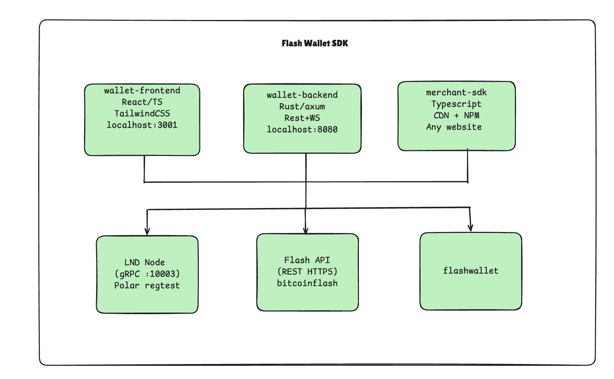
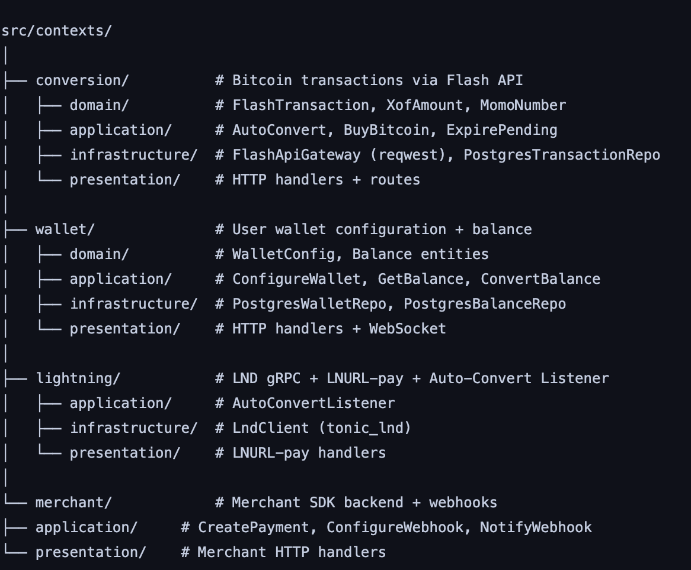
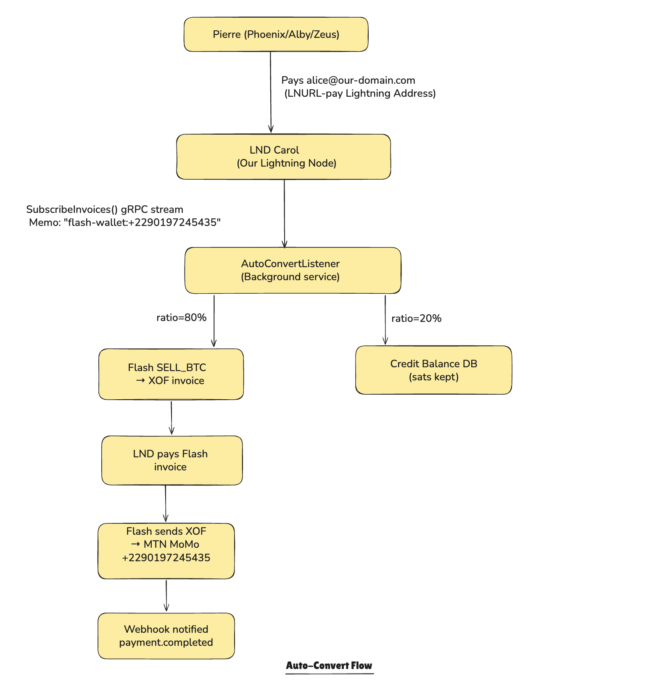
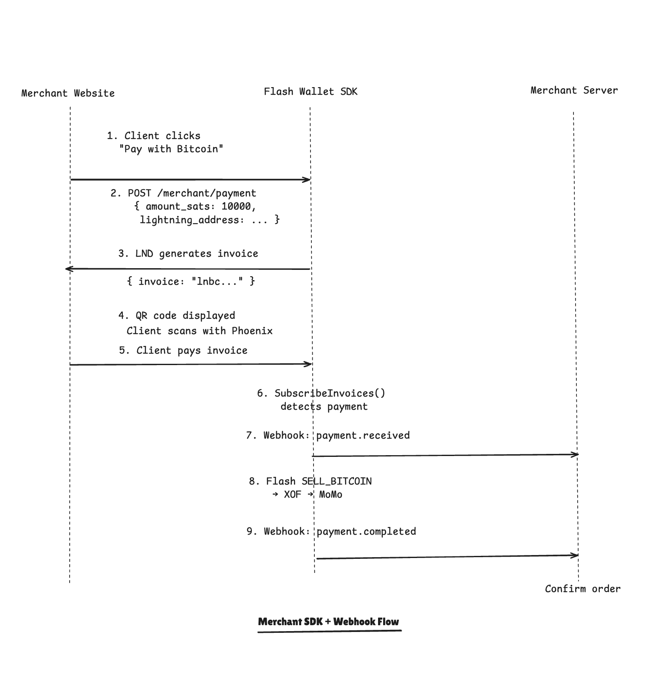
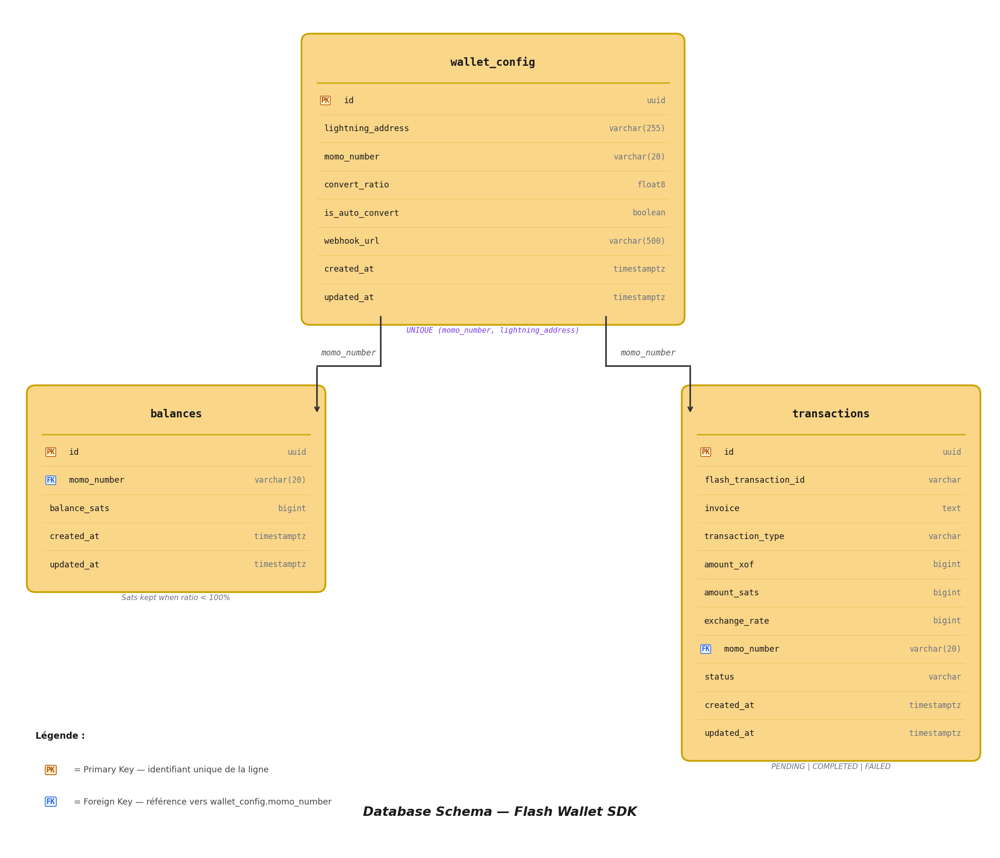
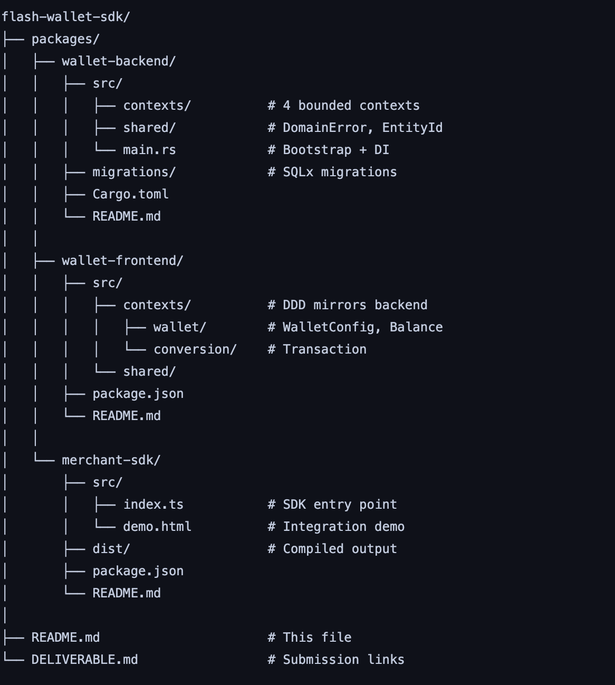

#  Flash Wallet SDK


A full-stack custodial Bitcoin Lightning wallet with automatic conversion to XOF via Mobile Money — built for West Africa on top of the [Flash API](https://docs.bitcoinflash.xyz).

**Author:** Elisée Assinou — Cotonou, Bénin
**Program:** Plan B Network Bitcoin Developer Track 2026
**Mentor:** [@maurientz](https://t.me/maurientz)

[](https://opensource.org/licenses/MIT)
[](https://www.rust-lang.org/)
[](https://github.com/elisee-assinou/flash-wallet-sdk)

---

##  The Problem

In West Africa — Bénin, Togo, Côte d'Ivoire — **Mobile Money is the primary financial infrastructure**. MTN MoMo, Moov Money, Celtiis, and Togocel serve millions of people who have no access to traditional banking.

Bitcoin adoption is growing fast. But the bridge between the Lightning Network and local mobile money is still:
- **Slow** — manual processes, no automation
- **Expensive** — high fees from intermediaries
- **Complex** — no simple tool for developers or merchants

Current reality:
Pierre receives sats → manually sells on exchange → waits 24-48h → MoMo
↑
Expensive, slow, manual
With Flash Wallet SDK:
Pierre receives sats → automatic conversion → XOF on MoMo in seconds
↑
Fast, cheap, automatic

---

##  The Solution

Flash Wallet SDK builds a **custodial Lightning wallet layer** on top of the Flash API with:

### Use Case 1 — Personal Wallet (Auto-Convert)
As a user in Bénin,
I want to receive sats via my Lightning Address
And have them automatically converted to XOF on my MTN MoMo
So that I can use my funds instantly without manual intervention.

### Use Case 2 — Configurable Conversion Ratio
As a user,
I want to choose what percentage of received sats to convert (10% to 100%)
So that I can keep some sats while converting the rest to XOF.
Example: ratio = 80%
→ 80% of received sats → XOF → MTN MoMo
→ 20% kept as sats in my Lightning balance

### Use Case 3 — Manual Conversion
As a user with a sats balance,
I want to manually trigger a conversion at any time
Using a slider to choose the percentage to convert.

### Use Case 4 — Merchant Payment Button (SDK)
As a merchant with a website,
I want to accept Bitcoin Lightning payments with 3 lines of code
And automatically receive XOF on my MoMo when a client pays.

### Use Case 5 — Merchant Webhook
As a merchant,
I want to receive real-time HTTP notifications when:
→ A client pays my Lightning invoice (payment.received)
→ Flash successfully converts to XOF (payment.completed)
→ A conversion fails (payment.failed)
So that I can automatically confirm orders on my platform.

### Use Case 6 — Multi-User
As a platform operator,
I want to host multiple users on the same backend instance
Each identified by their unique Lightning Address + MoMo combination
With full data isolation between users.

---

##  Architecture




### Backend Bounded Contexts (DDD + Hexagonal)


---

##  Auto-Convert Flow

---


##  Merchant SDK + Webhook Flow




---

## ️ Database Schema



## Stores Flash API transactions

### Balance Calculation (Source of Truth)
Available Balance = LND.list_settled_invoices(momo_number)
- SUM(transactions WHERE status IN ('PENDING', 'COMPLETED'))
  → LND is the cryptographic source of truth
  → No balance can be invented at DB level
  → FAILED transactions automatically restore the balance


---

## ️ Tech Stack

### wallet-backend (Rust)

| Library | Version | Role |
|---------|---------|------|
| axum | 0.7 | HTTP framework |
| tokio | 1 | Async runtime |
| sqlx | 0.8 | PostgreSQL ORM (compile-time queries) |
| tonic_lnd | 0.5.1 | LND gRPC client |
| reqwest | 0.12 | Flash API HTTP client |
| tokio-tungstenite | 0.24 | WebSocket server |
| tracing | 0.1 | Structured logging |
| serde / serde_json | 1 | JSON serialization |
| uuid | 1 | Entity IDs |
| chrono | 0.4 | Timestamps |

### wallet-frontend (React/TypeScript)

| Library | Role |
|---------|------|
| React 18 | UI framework |
| TypeScript | Type safety |
| TailwindCSS | Styling |
| Axios | HTTP client |
| lucide-react | Icons |
| WebSocket API | Real-time balance |

### merchant-sdk (TypeScript)

| Feature | Implementation |
|---------|---------------|
| Payment button | Vanilla JS + SVG icons |
| QR code | qrcode.js (CDN) |
| Modal | Pure CSS |
| Webhook | Backend POST notifications |

---

##  Project Structure



---

##  Getting Started

### Prerequisites

```bash
# Rust
curl --proto '=https' --tlsv1.2 -sSf https://sh.rustup.rs | sh

# sqlx-cli
cargo install sqlx-cli

# Node.js 18+
# PostgreSQL 14+
# Polar (local LND) — https://lightningpolar.com/
```

### 1. Clone

```bash
git clone https://github.com/elisee-assinou/flash-wallet-sdk
cd flash-wallet-sdk
```

### 2. Backend

```bash
cd packages/wallet-backend

# Create DB
createdb flash_wallet

# Configure
cp .env.example .env
# Edit .env with your Flash credentials + LND paths

# Migrate
sqlx migrate run --database-url postgresql://localhost/flash_wallet

# Run
cargo run
# → http://localhost:8080
# → http://localhost:8080/swagger-ui (API docs)
```

### 3. Frontend

```bash
cd packages/wallet-frontend
npm install
echo "REACT_APP_API_URL=http://localhost:8080" > .env.local
npm start
# → http://localhost:3001
```

### 4. Merchant SDK Demo

```bash
cd packages/merchant-sdk
npm install && npm run build
open src/demo.html
```

### 5. Test with Polar (Regtest)

```bash
# On carol node — generate invoice
lncli addinvoice --amt 100000 --memo "flash-wallet:+2290197245435"

# On alice node — pay it
lncli payinvoice PAYMENT_REQUEST

# Watch logs
cargo run 2>&1 | grep -E "INFO|ERROR|Flash"
```

---

##  API Reference

### Swagger UI

http://localhost:8080/swagger-ui

### Wallet

| Method | Endpoint | Description |
|--------|----------|-------------|
| POST | `/api/v1/wallet/configure` | Configure wallet |
| GET | `/api/v1/wallet?lightning_address=xxx` | Get wallet (exact match) |
| GET | `/api/v1/wallet/balance?lightning_address=xxx` | Real balance from LND |
| POST | `/api/v1/wallet/balance/convert` | Manual convert to XOF |

### Transactions

| Method | Endpoint | Description |
|--------|----------|-------------|
| POST | `/api/v1/transactions/convert` | Manual SELL_BITCOIN |
| POST | `/api/v1/transactions/buy` | BUY_BITCOIN |
| GET | `/api/v1/transactions` | List transactions |
| GET | `/api/v1/transactions/:id/status` | Transaction status |

### Lightning Address

| Method | Endpoint | Description |
|--------|----------|-------------|
| GET | `/.well-known/lnurlp/:username` | LNURL-pay metadata |
| GET | `/api/v1/lnurlp/:username/invoice?amount=xxx` | Generate invoice |

### Merchant

| Method | Endpoint | Description |
|--------|----------|-------------|
| POST | `/api/v1/merchant/payment` | Create payment invoice |
| POST | `/api/v1/merchant/webhook` | Configure webhook URL |

### WebSocket

| Endpoint | Description |
|----------|-------------|
| `ws://host/ws/balance?lightning_address=xxx` | Real-time balance (10s) |
| `ws://host/ws/transactions/:id` | Transaction status |

---

##  Merchant SDK Integration

```html
<!-- Step 1: Add the button container -->
<div id="pay-button"></div>

<!-- Step 2: Load the SDK -->
<script src="https://your-domain.com/merchant-sdk.js"></script>

<!-- Step 3: Initialize -->
<script>
  FlashSDK.mountButton('#pay-button', {
    backendUrl: 'https://your-wallet-backend.com',
    lightningAddress: 'store@bitcoinflash.xyz',
    amountSats: 10000,
    description: 'Order #123',
    onSuccess: (invoice) => console.log('Payment initiated!'),
    onError: (err) => console.error('Error:', err),
  });
</script>
```

### Configure Webhook

```bash
curl -X POST https://your-backend.com/api/v1/merchant/webhook \
  -H "Content-Type: application/json" \
  -d '{
    "lightning_address": "store@bitcoinflash.xyz",
    "webhook_url": "https://my-store.com/webhook/flash"
  }'
```

### Webhook Payload

```json
// payment.received — instantly on Lightning settlement
{
  "event": "payment.received",
  "amount_sats": 10000,
  "merchant": "store@bitcoinflash.xyz",
  "timestamp": "2026-04-12T13:24:33Z"
}

// payment.completed — when Flash pays XOF to MoMo (mainnet)
{
  "event": "payment.completed",
  "amount_sats": 10000,
  "invoice": "lnbc9570n1p5...",
  "merchant": "store@bitcoinflash.xyz",
  "timestamp": "2026-04-12T13:24:35Z"
}

// payment.failed — when conversion fails
{
  "event": "payment.failed",
  "amount_sats": 10000,
  "merchant": "store@bitcoinflash.xyz",
  "timestamp": "2026-04-12T13:24:35Z"
}
```

All webhook requests include: `X-Flash-Webhook: 1`

---

## ️ Limitations (Regtest → Mainnet)

This MVP runs on Polar regtest. The following table shows the current state vs production:

| Feature | Regtest | Mainnet |
|---------|---------|---------|
| LNURL-pay resolution | ✅ | ✅ |
| Invoice detection (LND) | ✅ | ✅ |
| Flash SELL_BITCOIN API | ✅ | ✅ |
| Flash invoice payment by LND | ❌ network mismatch | ✅ |
| XOF delivered to MoMo | ❌ | ✅ |
| Webhook `payment.received` | ✅ | ✅ |
| Webhook `payment.completed` | ❌ | ✅ |
| Webhook `payment.failed` | ✅ | ✅ |
| Multi-user isolation | ✅ | ✅ |
| JWT Authentication | ❌ MVP | ✅ |

---

## ️ Roadmap

### Phase 2 — Mainnet (Post-Lugano)
- [ ] LND mainnet deployment with real channels
- [ ] JWT authentication system
- [ ] Multi-country MoMo: Togo (Togocel), Côte d'Ivoire (MTN/Moov)

### Phase 3 — Scale
- [ ] React Native mobile app
- [ ] LNURL-withdraw support
- [ ] Taproot Assets integration
- [ ] Open-source contributions to LDK / Fedimint

---

##  Resources

- [Flash API Documentation](https://docs.bitcoinflash.xyz)
- [Lightning Address Protocol](https://lightningaddress.com/)
- [BOLT Specifications](https://github.com/lightning/bolts)
- [Plan B Network](https://planb.academy)
- [Polar — Local Lightning Dev](https://lightningpolar.com/)
- [Mastering Bitcoin — Andreas Antonopoulos](https://github.com/bitcoinbook/bitcoinbook)

---

##  Contributing

```bash
# Backend
cd packages/wallet-backend
cargo build
cargo clippy
cargo test

# Frontend
cd packages/wallet-frontend
npm install
npm start

# Merchant SDK
cd packages/merchant-sdk
npm install
npm run build
```

PRs welcome! Please follow the existing Clean Architecture + DDD patterns.

---

## 👤 Author

**Elisée Assinou, Backend Developer**
- Location: Cotonou, Bénin 
- Program: Plan B Network Bitcoin Developer Track 2026
- GitHub: [@elisee-assinou](https://github.com/elisee-assinou)
- Mentor: [@maurientz](https://t.me/maurientz)

---

##  License

MIT — see [LICENSE](LICENSE)
